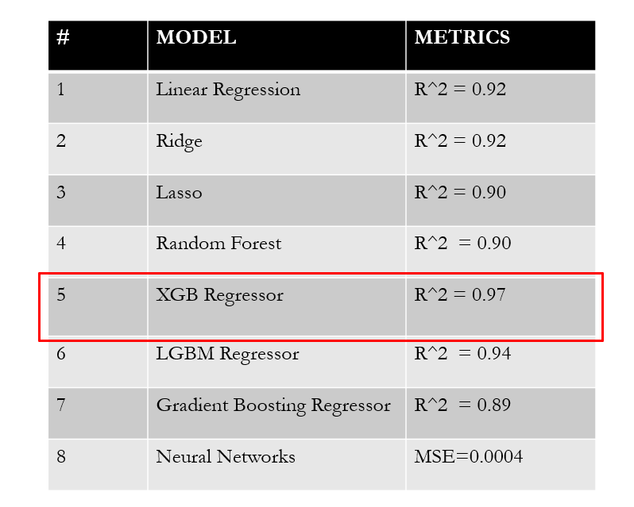

# UK Used Cars Price Estimator App
By Adriana Ovalle, Deepika Awasthi & Maria Lara

## Objective
This application helps estimating UK used cars price based on:  make, model, year, transmission, mileage, fuel type, miles per gallon (mpg), and engine size.
The application can be accessed at: https://usedcarspredict.herokuapp.com/

## Data Source
The data was downloded from Kaggle at: https://www.kaggle.com/adityadesai13/used-car-dataset-ford-and-mercedes?select=vw.csv. It contains 100,000 scraped used car listings, cleaned and split into car make. The last update was done in June, 2020.

## Architecture
* For Storage: Amazon Simple Storage Service (Amazon S3) was used because of its offering on scalability, data availability, security, and performance. 
* For Application Deployment: Heroku was used as cloud platform to deploy the application because its suppport of different programming languages.

## Technologies Used
A vartiety of technologies were combined for data analysis, machine learning, application functionality and user interface.

## Workflow Used for model selection
The following workflow was used to test 8 different regression models.

## Models Analyzed
 XGB egressor was selected at the moment of code freeze because of its high accuracy compared to the other models. Results of each model are presented in the table below.

## XGB Regressor Test
20 random samples were selected to test the XGB Regressor model. The predicted vs actual difference is below 4%.

## User Interface
The user interface allows the for the user to:
* Enter 8 criteria parameters: Car Make, Car Model, Purchase Year, Transmission, FuelType, Miles, MPG and Engine Size
* On "Estimate" button click, the following is updated:
     * Car images are updated according to Car Make selected
     * Estimation of used car price is show in £ and USD, based on the XGB regressor
     * Graph of selected Car Make is updated. User then can change options for year, model, fuel type and transmission to visualize the range of the price data
* The reset button will reset the estimation of the pricing.

